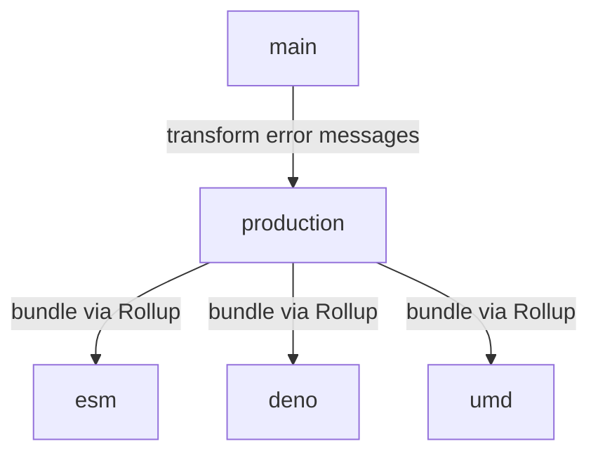

<!--

@license Apache-2.0

Copyright (c) 2022 The Stdlib Authors.

Licensed under the Apache License, Version 2.0 (the "License");
you may not use this file except in compliance with the License.
You may obtain a copy of the License at

   http://www.apache.org/licenses/LICENSE-2.0

Unless required by applicable law or agreed to in writing, software
distributed under the License is distributed on an "AS IS" BASIS,
WITHOUT WARRANTIES OR CONDITIONS OF ANY KIND, either express or implied.
See the License for the specific language governing permissions and
limitations under the License.

-->

# Branches

This repository contains the following branches:

-   `main`: standalone package repository (default) generated from the [stdlib monorepo][monorepo], where all development is taking place.
-   `production`: production build of the package with error messages being rewritten to reduce bundle sizes and thus the number of bytes transmitted over the network.
-   `esm`: [ES Module][esm-url] branch for use in a website via a `script` tag without installation and bundlers.
-   `deno`: [Deno][deno-url] branch for use in Deno.
-   `umd`: [UMD][umd-url] branch for use in Observable, or in dual browser/Node.js environments.

The following Mermaid diagram illustrate the relationship between the various branches:

[monorepo]: https://github.com/stdlib-js/stdlib/tree/develop/lib/node_modules/%40stdlib/string/snakecase
[deno-url]: https://github.com/stdlib-js/string-snakecase/tree/deno
[umd-url]: https://github.com/stdlib-js/string-snakecase/tree/umd
[esm-url]: https://github.com/stdlib-js/string-snakecase/tree/esm
